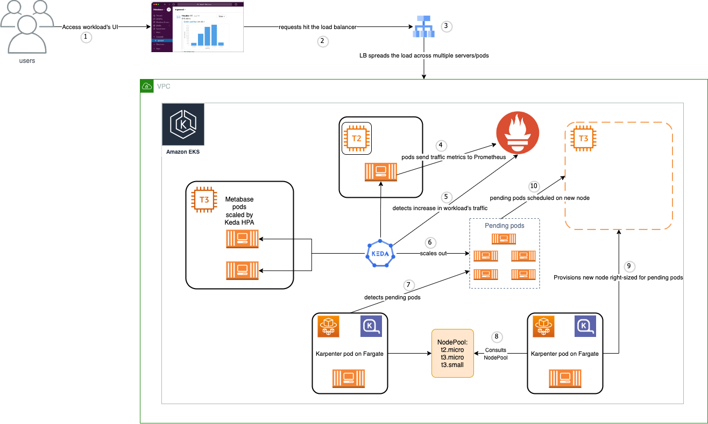
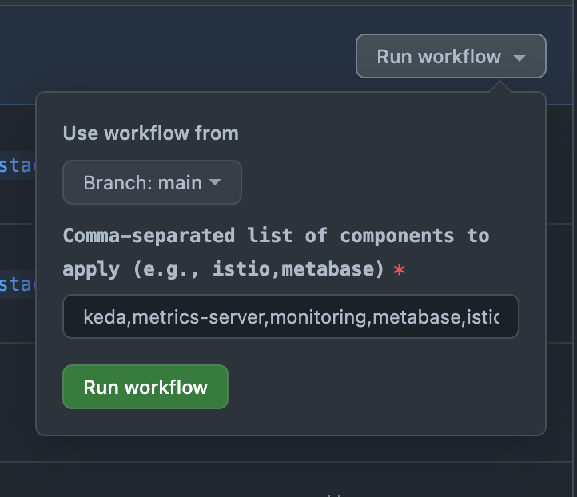

# Scaling Metabase with EKS on Fargate, Karpenter and Keda

The goal of this project is to demonstrate the use of Kubernetes on AWS to scale Metabase, an open-source business intelligence tool. The project uses the following tools:

- **Terraform:** For infrastructure as code.
- **EKS:** For managed Kubernetes on AWS.
- **Fargate:** For serverless compute on Kubernetes.
- **Karpenter:** For autoscaling Kubernetes clusters.
- **Metabase:** For business intelligence and analytics.
- **GitHub Actions:** For CI/CD.
- **Docker:** For local development and testing.
- **Istio:** For service mesh.
- **Prometheus and Grafana:** For monitoring and observability.
- **Keda:** For scaling Metabase based on requests per second and memory usage.

This is the project architecture:



Here is the project tree overview:

```bash
.
|-- .github
|   |-- workflows
|   |   |-- apply-all.yaml
|   |   |-- apply-workflow.yaml
|   |   |-- destroy-workflow.yaml
|   |   |-- manual-apply.yaml
|   |   |-- plan-workflow.yaml
|   |   |-- stack-workflow.yaml
|   |   `-- uninstall-workflow.yaml
|-- README.md
|-- annotations.md
|-- assets
|   `-- helm-workflow.png
|-- environments
|   |-- dev
|   `-- lab
|       |-- backend.tf
|       |-- main.tf
|       |-- outputs.tf
|       |-- providers.tf
|       |-- s3-dynamodb
|       |   `-- main.tf
|       `-- variables.tf
|-- infra
|   |-- backend
|   |   |-- main.tf
|   |   |-- outputs.tf
|   |   `-- variables.tf
|   |-- eks-fargate-karpenter
|   |   |-- main.tf
|   |   |-- outputs.tf
|   |   `-- variables.tf
|   |-- rds
|   |   |-- main.tf
|   |   |-- outputs.tf
|   |   `-- variables.tf
|   `-- vpc
|       |-- main.tf
|       |-- outputs.tf
|       `-- variables.tf
|-- scripts
|   `-- calculate_cluster_size.sh
|-- stack
|   |-- istio
|   |   |-- istio-ingress.yaml
|   |   |-- istiod-values.yaml
|   |   |-- pod-monitor.yaml
|   |   `-- service-monitor.yaml
|   |-- keda
|   |   `-- values.yaml
|   |-- metabase
|   |   |-- metabase-hpa.yaml
|   |   |-- metabase-scaling-dashboard.yaml
|   |   `-- values.yaml
|   `-- monitoring
|       `-- values.yaml
`-- trimmed.Dockerfile
```

## Step 1: Project Setup

This phase involves setting up a local Docker environment tailored for SRE/DevOps tasks and the core AWS infrastructure.

### Docker Image Configuration

- **Base Image:** Ubuntu latest version.
- **Included Tools:**
  - Kubernetes command-line tools (`kubectl`, `kubectx`, `kubens`).
  - Helm for Kubernetes package management.
  - Terraform and Terragrunt for infrastructure as code.
  - AWS CLI for interacting with Amazon Web Services.
  - `k6` from Load Impact for performance testing.
  - Basic utilities like `curl`, `git`, `wget`, `bash-completion`, `software-properties-common`, `groff`, `unzip`, and `tree`.

### Terraform Backend Module

This module sets up an S3 bucket and a DynamoDB table:


```hcl
provider "aws" {
  region = var.region
}

resource "aws_s3_bucket" "terraform_state" {
  bucket = var.bucket_name

  lifecycle {
    prevent_destroy = true
  }
}

resource "aws_s3_bucket_versioning" "terraform_state" {
  bucket = aws_s3_bucket.terraform_state.id

  versioning_configuration {
    status = "Enabled"
  }
}

resource "aws_dynamodb_table" "terraform_state_lock" {
  name           = var.dynamodb_table_name
  read_capacity  = 1
  write_capacity = 1
  hash_key       = "LockID"

  attribute {
    name = "LockID"
    type = "S"
  }
}
```

Which can be used by the lab environment as follows:

```hcl
terraform {
  backend "s3" {
    bucket  = "tfstate-kaio-lab"
    key     = "tfstate-kaio-lab-lock"
    region  = "us-east-1"
    encrypt = true
  }
}
```

### GitHub Workflows Configuration

The following workflows were created to automate the CI/CD process:

- **plan-workflow.yaml:** Runs `terraform plan` to review the changes that will be applied to the infrastructure. It triggers on pull requests to the `main` branch.
- **apply-workflow.yaml:** Runs `terraform apply` to apply the changes to the infrastructure in a specific order using the `target` parameter. It triggers on pushes to the `main` branch. To avoid triggering this workflow, like when only documentation changes are made, add `[skip ci]` to the commit message.
- **destroy-workflow.yaml:** Runs `terraform destroy` to destroy the infrastructure. It can only be triggered manually from the GitHub Actions page.
- **stack-workflow.yaml:** Runs `helm upgrade --install` or `helm uninstall` on all the extra Kubernetes components as well as Metabase. It can only be triggered manually from the GitHub Actions page on the `cluster-stack` or `main` branches. You can also select which addon or workload to upgrade or uninstall by adding their names as inputs to the workflow:



For quick tests, the best option is to push changes to the `cluster-stack` branch and trigger this workflow manually. This way, you can test the changes without affecting the main branch.

### Initial Terraform and AWS Configuration Steps

1. [Create a Terraform user with access keys in AWS IAM](https://medium.com/@CloudTopG/discover-the-3-steps-to-creating-an-iam-user-with-access-secret-access-keys-for-terraform-scripts-28110e280460).
2. Run `terraform init` in the root folder, which is `environments/lab`, to install the required plugins.
3. In the docker environment, execute `aws configure` to set up the AWS CLI to use the access keys locally.
4. Add the AWS Access Key ID and AWS Secret Access Key to Github Secrets in the repository settings.
5. Navigate to `environments/lab/s3-dynamodb` and run `terraform init` to initialize the terraform state.
6. Execute `terraform plan` to review what resources will be created.
7. Run `terraform apply` to create the resources, including the s3 bucket and dynamodb table. Ensure the bucket name is unique to avoid errors. If working in a docker environment without live file system sync, rebuild the container to reflect new files.

## Step 2: AWS Core Infrastructure: The Trio — EKS, Karpenter and Fargate

### AWS Infrastructure Configuration with Terraform

Following the setup of the local Docker environment, Github Actions CI/CD and S3 backend, the next step involved configuring the core AWS infrastructure using Terraform.

1. **VPC Creation:** 
   - A VPC named `lab-vpc` was created, providing isolated network space. The lab environment used the infra/vpc module to do this.
   - Subnets were established across 3 Availability Zones for high availability and fault tolerance.

      ```hcl
      module "lab_vpc" {
        source = "../../infra/vpc"

        name            = local.name
        vpc_cidr        = local.vpc_cidr
        azs             = local.azs
        private_subnets = ["10.0.0.0/19", "10.0.32.0/19", "10.0.128.0/19"]
        public_subnets  = ["10.0.64.0/19", "10.0.96.0/19", "10.0.160.0/19"]
        intra_subnets   = ["10.0.192.0/19", "10.0.224.0/19"]

        tags = local.tags
      }
      ```

2. **EKS Cluster Setup on Fargate and Karpenter:**
   - An EKS cluster named `metabaselab` was created, leveraging the latest Kubernetes version for enhanced features and security.
   - Fargate was used as an option, offering serverless compute for Kubernetes. It can be useful to run pods that require less than the minimum EC2 instance size of the smallest available instance type.
   - Karpenter pods run on Fargates nodes to avoid running it on the nodes it manages. This way, if the nodes are scaled down, Karpenter will still be running on Fargate nodes.
   - Running Karpenter on Fargate provides resilience, as Fargate offers reliability and uptime, making it suitable for Karpenter deployment in scenarios where deep integration with the host or certain Kubernetes tooling isn't essential.
   - Karpeneter was deployed to manage the autoscaling of the EKS cluster with a NodePool consisting of free-tier EC2 instances and `t3.small`, the next smaller instance option.

If a namespace has a Fargate profile, pods will be scheduled on Fargate. If not, pods will be scheduled on EC2 instances by the Kubernetes scheduler. If an unscheduled is detected, Karpenter will provision a new node with most effective instance type available to run the pod.

```hcl
module "eks_fargate_karpenter" {
  source = "../../infra/eks-fargate-karpenter"

  cluster_name             = "metabaselab"
  cluster_version          = "1.28"
  vpc_id                   = module.lab_vpc.vpc_id
  subnet_ids               = module.lab_vpc.private_subnets
  control_plane_subnet_ids = module.lab_vpc.intra_subnets

  providers = {
    kubectl.gavinbunney = kubectl.gavinbunney
    aws.virginia        = aws.virginia
  }

  fargate_profiles = {
    karpenter = {
      selectors = [
        { namespace = "karpenter" }
      ]
    }
    kube-system = {
      selectors = [
        { namespace = "kube-system" }
      ]
    }
  }
}
```

### Deployment Example

An example deployment using the Kubernetes pause image was included in the eks-fargate-karpenter module to demonstrate Karpenter's scaling capabilities. This deployment initially start with zero replicas:

```hcl
resource "kubectl_manifest" "karpenter_example_deployment" {
  yaml_body = <<-YAML
    apiVersion: apps/v1
    kind: Deployment
    metadata:
      name: inflate
    spec:
      replicas: 0
      selector:
        matchLabels:
          app: inflate
      template:
        metadata:
          labels:
            app: inflate
        spec:
          terminationGracePeriodSeconds: 0
          containers:
            - name: inflate
              image: public.ecr.aws/eks-distro/kubernetes/pause:3.7
              resources:
                requests:
                  cpu: 1
  YAML

  depends_on = [
    helm_release.karpenter
  ]
}
```

To test Karpenter, just run `kubectl scale deployment inflate --replicas=10` and Karpenter will provision more nodes to run the pods

## Step 3: Provisioning RDS

The next step involved provisioning an RDS instance to be used as the Metabase database. The RDS instance was created using the infra/rds module. The module is used by the lab environment as follows:

```hcl
module "lab_rds" {
  source = "../../infra/rds"

  db_name     = local.name
  db_username = local.name
  db_port     = 3306
  db_password = var.db_password

  vpc_security_group_ids = [module.security_group.security_group_id, module.eks_fargate_karpenter.cluster_primary_security_group_id]
  subnet_ids             = module.lab_vpc.private_subnets

  tags = local.tags
}
```

```hcl
module "security_group" {
  source  = "terraform-aws-modules/security-group/aws"
  version = "~> 5.0"

  name   = local.name
  vpc_id = module.lab_vpc.vpc_id

  # ingress
  ingress_with_source_security_group_id = [
    {
      source_security_group_id = module.eks_fargate_karpenter.cluster_primary_security_group_id
      from_port                = 3306
      to_port                  = 3306
      protocol                 = "tcp"
      description              = "MySQL access from within VPC"
    },
  ]

  tags = local.tags
}
```

This way, the RDS instance is created in the same VPC as the EKS cluster and in the private subnets. A security group with an ingress rule for port 3306 is also created to allow access to the RDS instance from within the EKS cluster.

It is decoupled from the Metabase deployment to allow for more flexibility. For example, if you want to use a different database for Metabase, you can just change the database connection string in the Metabase deployment.

## Step 4: Deploying AWS Load Balancer Controller

The AWS Load Balancer Controller was deployed to allow access to the services from outside the cluster. The following components were deployed using the main Terraform workflow:

```hcl
data "http" "iam_policy" {
  url = "https://raw.githubusercontent.com/kubernetes-sigs/aws-load-balancer-controller/main/docs/install/iam_policy.json"
}

resource "aws_iam_policy" "load_balancer_controller" {
  name        = "AWSLoadBalancerControllerIAMPolicy"
  description = "IAM policy for AWS Load Balancer Controller"
  policy      = data.http.iam_policy.body
}

resource "aws_iam_role" "load_balancer_controller_role" {
  name = "eks-load-balancer-controller-role"

  assume_role_policy = jsonencode({
    Version = "2012-10-17",
    Statement = [
      {
        Action = "sts:AssumeRoleWithWebIdentity",
        Effect = "Allow",
        Principal = {
          Federated = "arn:aws:iam::${data.aws_caller_identity.current.account_id}:oidc-provider/oidc.eks.${local.region}.amazonaws.com/id/${local.oidc_id}"
        },
        Condition = {
          StringEquals = {
            "${module.eks_fargate_karpenter.oidc_provider.oidc_provider}:sub" : "system:serviceaccount:kube-system:aws-load-balancer-controller"
            "${module.eks_fargate_karpenter.oidc_provider.oidc_provider}:aud" : "sts.amazonaws.com"
          }
        }
      }
    ]
  })
}

resource "aws_iam_role_policy_attachment" "load_balancer_controller_policy_attach" {
  role       = aws_iam_role.load_balancer_controller_role.name
  policy_arn = aws_iam_policy.load_balancer_controller.arn
}

resource "kubernetes_service_account" "load_balancer_controller" {
  metadata {
    name      = "aws-load-balancer-controller"
    namespace = "kube-system"
    annotations = {
      "eks.amazonaws.com/role-arn" = aws_iam_role.load_balancer_controller_role.arn
    }
  }
}

resource "helm_release" "aws_load_balancer_controller" {
  name       = "aws-load-balancer-controller"
  repository = "https://aws.github.io/eks-charts"
  chart      = "aws-load-balancer-controller"
  namespace  = "kube-system"

  set {
    name  = "clusterName"
    value = local.name
  }

  set {
    name  = "region"
    value = local.region
  }

  set {
    name  = "serviceAccount.create"
    value = "false"
  }

  set {
    name  = "serviceAccount.name"
    value = "aws-load-balancer-controller"
  }

  set {
    name  = "vpcId"
    value = module.lab_vpc.vpc_id
  }

  timeout = 3600
  wait    = true

  depends_on = [aws_iam_role.load_balancer_controller_role, kubernetes_service_account.load_balancer_controller]
}
```

With the AWS Load Balancer Controller, you have two options to expose services outside the cluster:

1. **Using Istio Ingress Gateway**: 
   - It allows you to leverage Istio's features like traffic management, security, observability, etc. To use this option, you need to create a VirtualService and a Gateway for each service you want to expose.
2. **Creating Services of Type LoadBalancer**:
   - A simpler approach is to create Kubernetes services with the type set to `LoadBalancer`. This will automatically create an AWS load balancer (Classic or ALB/NLB, based on the annotations) for each service.
   - For each Kubernetes service you want to expose, specify the type as `LoadBalancer` and include the necessary annotations to control the AWS Load Balancer behavior. For example, `service.beta.kubernetes.io/aws-load-balancer-scheme: "internet-facing"`.
   - This method is straightforward and suitable for applications that don't require the advanced routing and management capabilities provided by Istio. It's a good fit for simpler architectures where each service is directly exposed through its own load balancer.

## Step 5: Deploying cluster stack: metrics-server, kube-prometheus-stack, Istio, KEDA and Metabase

This step is crucial to make Metabase scale based on requests per second and memory usage, as well as monitoring and observability. The components were deployed using the stack workflow:

```yaml
name: Cluster Stack Management

env:
  AWS_ACCESS_KEY_ID: ${{ secrets.AWS_ACCESS_KEY_ID }}
  AWS_SECRET_ACCESS_KEY: ${{ secrets.AWS_SECRET_ACCESS_KEY }}
  AWS_DEFAULT_REGION: 'us-east-1'
  EKS_CLUSTER_NAME: 'metabaselab'
  RDS_PASSWORD: ${{ secrets.RDS_PASSWORD }}

on:
  workflow_dispatch:
    inputs:
      components:
        description: 'Comma-separated list of components to apply (e.g., istio,metabase)'
        required: true
        default: 'keda,metrics-server,monitoring,metabase,istio'

jobs:
  helm:
    runs-on: ubuntu-latest
    steps:
      - name: Checkout Repository
        uses: actions/checkout@v2

      - name: Configure AWS credentials
        uses: aws-actions/configure-aws-credentials@v1
        with:
          aws-access-key-id: ${{ secrets.AWS_ACCESS_KEY_ID }}
          aws-secret-access-key: ${{ secrets.AWS_SECRET_ACCESS_KEY }}
          aws-region: ${{ env.AWS_DEFAULT_REGION }}

      - name: Update kube config
        run: aws eks update-kubeconfig --name $EKS_CLUSTER_NAME --region $AWS_DEFAULT_REGION

      - name: Set up Helm
        uses: azure/setup-helm@v1
        with:
          version: 'v3.13.3'

      - name: Install metrics-server
        if: contains(github.event.inputs.components, 'metrics-server')
        run: |
          kubectl apply -f https://github.com/kubernetes-sigs/metrics-server/releases/latest/download/high-availability-1.21+.yaml

      - name: Helm install kube-prometheus-stack(monitoring)
        if: contains(github.event.inputs.components, 'monitoring')
        run: |
          helm repo add prometheus-community https://prometheus-community.github.io/helm-charts
          helm repo update
          cd stack/monitoring
          helm upgrade --install monitoring prometheus-community/kube-prometheus-stack --namespace monitoring -f values.yaml --create-namespace

      - name: Helm install Istio
        if: contains(github.event.inputs.components, 'istio')
        run: |
          helm repo add istio https://istio-release.storage.googleapis.com/charts
          helm repo update
          cd stack/istio
          helm upgrade --install istio-base istio/base -n istio-system --create-namespace --set defaultRevision=default
          helm upgrade --install istiod istio/istiod -n istio-system -f istiod-values.yaml --wait
          kubectl apply -f pod-monitor.yaml && kubectl apply -f service-monitor.yaml
          helm upgrade --install istio-ingressgateway istio/gateway -n istio-system -f istio-ingress.yaml --wait

      - name: Helm install KEDA
        if: contains(github.event.inputs.components, 'keda')
        run: |
          helm repo add kedacore https://kedacore.github.io/charts
          helm repo update
          cd stack/keda
          helm upgrade --install keda kedacore/keda --namespace keda -f values.yaml --create-namespace

      - name: Fetch RDS Endpoint for Metabase
        if: contains(github.event.inputs.components, 'metabase')
        run: |
          RDS_ENDPOINT=$(aws rds describe-db-instances --db-instance-identifier metabaselab --query 'DBInstances[0].Endpoint.Address' --output text)
          echo "RDS_ENDPOINT=$RDS_ENDPOINT" >> $GITHUB_ENV

      - name: Helm install Metabase
        if: contains(github.event.inputs.components, 'metabase')
        run: |
          if ! kubectl get namespace metabase; then
            kubectl create namespace metabase
            kubectl label namespace metabase istio-injection=enabled
          fi

          helm repo add pmint93 https://pmint93.github.io/helm-charts
          helm repo update
          cd stack/metabase
          helm upgrade --install metabase pmint93/metabase --namespace metabase -f values.yaml --create-namespace \
            --set database.host="$RDS_ENDPOINT" \
            --set database.password="${{ secrets.RDS_PASSWORD }}"
          kubectl apply -f metabase-hpa.yaml && kubectl apply -f metabase-scaling-dashboard.yaml
```

- **Metrics Server Deployment**: Automates the installation of Metrics Server for Kubernetes, pivotal for enabling autoscaling (HPA) and resource usage visibility.
- **Kube-Prometheus-Stack Initialization**: Uses Helm to set up the Kube-Prometheus-Stack, integrating Prometheus for monitoring and Grafana for dashboards.
- **Istio Setup via Helm**: Implements Istio service mesh deployment, enhancing the cluster's traffic management, security, and observability. Includes the installation of Istio base, Istiod (control plane), and Ingress Gateway for external traffic management.
- **Istio Ingrees Gateway**: To allow access to the services from outside the cluster. It's not being used, but it's there if you want to use it.
- **Istio PodMonitor and ServiceMonitor**: To monitor the Istio pods and services using Prometheus. It is necessary to be able to query traffic metrics from namespaces with Istio sidecars, like Metabase. It makes it possible to scale Metabase based on requests per second.
- **KEDA (Kubernetes Event-driven Autoscaling) Installation**: Orchestrates the setup of KEDA, facilitating advanced event-driven autoscaling mechanisms in the Kubernetes environment.
- **Keda Dashboard**: To monitor the Keda ScaledObjects and HPAs. It's useful to observe the scaling of Metabase.
- **Metabase Deployment**: Deploys Metabase to the EKS cluster, leveraging Helm and the Metabase chart. The chart is customized to use the RDS instance as the database and to use Istio as the service mesh.
- **Metabase Horizontal Pod Autoscaler (HPA)**: Implements the HPA for Metabase, allowing the cluster to scale the Metabase deployment based on requests per second and memory usage.
- **Metabase Scaling Dashboard**: Sets up a Grafana dashboard for Metabase, providing visibility into the scaling of the Metabase deployment.

## Step 6: Metabase Deployment

This step involved deploying Metabase to the EKS cluster. The deployment was done using Helm and the metabase chart.

### Metabase Helm Chart Configuration

The following configuration was used to deploy Metabase:

```yaml
database:
  type: mysql
  port: 3306
  dbname: metabaselab
  username: metabaselab
service:
  name: metabase
  type: LoadBalancer
  externalPort: 80
  internalPort: 3000
  annotations:
    service.beta.kubernetes.io/aws-load-balancer-type: "external"
    service.beta.kubernetes.io/aws-load-balancer-nlb-target-type: "ip"
    service.beta.kubernetes.io/aws-load-balancer-scheme: "internet-facing"
resources:
  requests:
    cpu: 1000m
    memory: 800Mi
  limits:
    cpu: 1250m
    memory: 1Gi
monitoring:
  enabled: true
  serviceMonitor:
    enabled: true
  port: 9191
strategy:
  type: Recreate
# JavaOpts: "-Xms:300m -Xmx:250m" # https://www.metabase.com/docs/latest/operations-guide/java-opts.html
```

1. Database Configuration: Specifies Metabase's connection to a MySQL database, including the host, port, database name, username, and password, with values sourced from environment variables.
2. Service & Resources: Defines the service type as ClusterIP for internal cluster communication and allocates resource requests for CPU and memory in the Kubernetes environment.

The defined resource requests and limits were strongly by these references:

- [What are metabase minimum resources?](https://discourse.metabase.com/t/what-are-metabase-minimum-resources/21470)
- [Metabase at scale - Horizontal scaling(preferred)](https://www.metabase.com/learn/administration/metabase-at-scale#horizontal-scaling-preferred)
- [Metabase memory optimization guide](https://www.restack.io/docs/metabase-knowledge-metabase-increase-memory-guide)
- [Setting the Heap Size](https://docs.oracle.com/cd/E15289_01/JRPTG/tune_footprint.htm#i1002100)

### Scaling Metabase with Keda

Keda was used to scale Metabase. The following ScaledObject was used:

```yaml
apiVersion: keda.sh/v1alpha1
kind: ScaledObject
metadata:
  name: metabase
  namespace: metabase
spec:
  scaleTargetRef:
    kind: Deployment
    name: metabase
  minReplicaCount: 1
  maxReplicaCount: 10
  cooldownPeriod: 30
  pollingInterval: 1 
  fallback:
    failureThreshold: 1
    replicas: 1
  triggers:
  - type: prometheus
    metadata:
      serverAddress: http://prometheus-operated.monitoring:9090
      metricName: requests_per_second
      # (rate) will give us the number of requests per second within a 2 minute window. sum() will add add data from all pods.
      query: |
        sum(rate(istio_requests_total{destination_workload="metabase"}[2m]))
      threshold: "100"
  - type: memory
    metricType: Utilization
    metadata:
      value: "110"
```

The ScaledObject above scales the Metabase deployment based on the number of requests per second and memory usage. It uses the Prometheus metric `istio_requests_total` to get the number of requests per second and the Kubernetes metric `memory` to get the memory usage. The ScaledObject is configured to scale the deployment to a minimum of 1 replica and a maximum of 10 replicas. It also has a cooldown period of 30 seconds and a polling interval of 1 second. If the metrics are not available, it will fallback to 1 replica.

After deploying the ScaledObject, you can check the HPA created by Keda:

```bash
sre@99326d08570e:~$ kubectl get hpa -n metabase
NAME                REFERENCE             TARGETS                       MINPODS   MAXPODS   REPLICAS   AGE
keda-hpa-metabase   Deployment/metabase   107143m/100 (avg), 75%/150%   1         10        7          88m
```

## Step 7: Accessing Metabase, Grafana and Prometheus

To access the Metabase, Grafana and Prometheus UIs,  you can do the following:

1. Get their service's IP address:

```bash
kubectl get svc -A
NAMESPACE      NAME                                                 TYPE           CLUSTER-IP       EXTERNAL-IP                                                                     PORT(S)                                      AGE
metabase       metabase                                             LoadBalancer   172.20.64.5      xxxxx.elb.us-east-1.amazonaws.com   80:30961/TCP,9191:30516/TCP                  89m
monitoring     monitoring-grafana                                   LoadBalancer   172.20.138.142   xxxxx.elb.us-east-1.amazonaws.com   80:31815/TCP                                 90m
monitoring     monitoring-kube-prometheus-prometheus                LoadBalancer   172.20.160.99    xxxxx.elb.us-east-1.amazonaws.com   9090:32740/TCP,8080:30352/TCP                90m

```

You can access the services by appending the appropriate path to this IP address in your browser. For example:

- Metabase: `xxxxx.elb.us-east-1.amazonaws.com`
- Grafana: `xxxxx.elb.us-east-1.amazonaws.com`
- Prometheus: `xxxxx.elb.us-east-1.amazonaws.com:9090/graph`

## Summary

This project demonstrated how to use Kubernetes on AWS EKS with Fargate, Karpenter and Keda to scale workloads flexibly and dynamically using Metabase as the guinea pig, an open-source business intelligence tool.

Access to the services was made possible by Istio, which was also used as the service mesh. Prometheus and Grafana were used for monitoring and observability, as well as providing metrics and a dashboard for Keda, where we can observe the scaling of Metabase:


