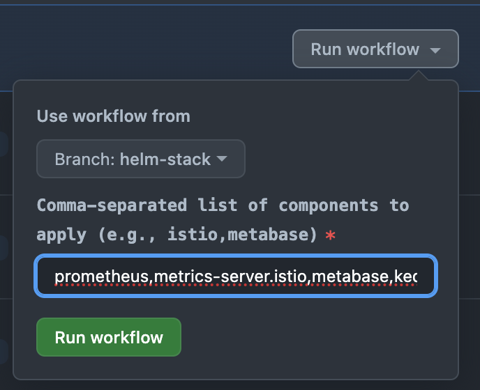
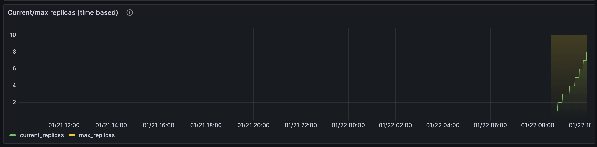

# Scaling Metabase with EKS on Fargate and Karpenter and Keda

The goal of this project is to demonstrate the use of Kubernetes on AWS to scale Metabase, an open-source business intelligence tool. The project uses the following tools:

- **Terraform:** For infrastructure as code.
- **EKS:** For managed Kubernetes on AWS.
- **Fargate:** For serverless compute on Kubernetes.
- **Karpenter:** For autoscaling Kubernetes clusters.
- **Metabase:** For business intelligence and analytics.
- **GitHub Actions:** For CI/CD.
- **Docker:** For local development and testing.
- **Istio:** For service mesh.
- **Prometheus and Grafana:** For monitoring and observability.
- **Keda:** For scaling Metabase based on requests per second and memory usage.

Here is the project tree overview:

```bash
.
|-- .github
|   `-- workflows
|       |-- apply-workflow.yaml
|       |-- destroy-workflow.yaml
|       |-- helm-workflow.yaml
|       `-- plan-workflow.yaml
|-- assets
|-- README.md
|-- environments
|   |-- dev
|   `-- lab
|       |-- backend.tf
|       |-- main.tf
|       |-- outputs.tf
|       |-- providers.tf
|       |-- s3-dynamodb
|       |   `-- main.tf
|       `-- variables.tf
|-- helm
|   |-- istio
|   |   |-- gateway.yaml
|   |   |-- istiod-values.yaml
|   |   |-- podmonitor.yaml
|   |   |-- scaledobject.yaml
|   |   |-- servicemonitor.yaml
|   |-- keda
|   |   |-- keda-dashboard.yaml
|   |   `-- values.yaml
|   |-- kube-prometheus-stack
|   |   |-- grafana-vs.yaml
|   |   |-- prometheus-vs.yaml
|   |   `-- values.yaml
|   `-- metabase
|       |-- metabase-vs.yaml
|       |-- scaledobject.yaml
|       `-- values.yaml
|-- infra
|   |-- backend
|   |   |-- main.tf
|   |   |-- outputs.tf
|   |   `-- variables.tf
|   |-- eks-fargate-karpenter
|   |   |-- main.tf
|   |   |-- outputs.tf
|   |   `-- variables.tf
|   |-- rds
|   |   |-- main.tf
|   |   `-- variables.tf
|   `-- vpc
|       |-- main.tf
|       |-- outputs.tf
|       `-- variables.tf
|-- .gitignore
|-- .dockerignore
`-- trimmed.Dockerfile
```

## Step 1: Project Setup

This phase involves setting up a local Docker environment tailored for SRE/DevOps tasks. The environment includes necessary tools and configurations for infrastructure management and development.

### Docker Image Configuration

- **Base Image:** Ubuntu latest version.
- **Included Tools:**
  - Kubernetes command-line tools (`kubectl`, `kubectx`, `kubens`).
  - Helm for Kubernetes package management.
  - Terraform and Terragrunt for infrastructure as code.
  - AWS CLI for interacting with Amazon Web Services.
  - `k6` from Load Impact for performance testing.
  - Basic utilities like `curl`, `git`, `wget`, `bash-completion`, `software-properties-common`, `groff`, `unzip`, and `tree`.

### User Setup

- A non-root user `sre` is created to ensure safer operations within the container.
- The working directory is set to `/home/sre`.

### File Permissions

- Proper file permissions are set to ensure that the `sre` user can operate effectively.

A more complete version of this local environment can be found [here](https://github.com/kaiohenricunha/devops-sre-environment).

### Terraform Backend Module

This module sets up an S3 bucket and a DynamoDB table to be used as a Terraform backend.


```hcl
module "backend" {
  source              = "./path/to/terraform-backend"
  region              = "us-east-1"
  bucket_name         = "my-terraform-state-bucket"
  dynamodb_table_name = "my-terraform-state-lock"
}
```

### GitHub Workflows Configuration

The following workflows were created to automate the CI/CD process:

- **plan-workflow.yaml:** Runs `terraform plan` to review the changes that will be applied to the infrastructure. It triggers on pull requests to the `main` branch.
- **apply-workflow.yaml:** Runs `terraform apply` to apply the changes to the infrastructure in a specific order using the `target` parameter. It triggers on pushes to the `main` branch. To avoid triggering this workflow, like when only documentation changes are made, add `[skip ci]` to the commit message.
- **destroy-workflow.yaml:** Runs `terraform destroy` to destroy the infrastructure. It can only be triggered manually from the GitHub Actions page.
- **helm-workflow.yaml:** Runs `helm upgrade --install` or `helm uninstall` on all the addons as well as Metabase. It can only be triggered manually from the GitHub Actions page of the `helm-stack` branch. You can also select which addon or workload to upgrade or uninstall by adding their names as inputs to the workflow:



### Initial Terraform and AWS Configuration Steps

1. Create a Terraform user with access keys in AWS IAM.
2. Run `terraform init` in the root folder, which is `environments/lab`, to install the required plugins.
3. In the docker environment, execute `aws configure` to set up the AWS CLI to use the access keys locally.
4. Add the AWS Access Key ID and AWS Secret Access Key to Github Secrets in the repository settings.
5. Navigate to `environments/lab/s3-dynamodb` and run `terraform init` to initialize the terraform state.
6. Execute `terraform plan` to review what resources will be created.
7. Run `terraform apply` to create the resources, including the s3 bucket and dynamodb table. Ensure the bucket name is unique to avoid errors. If working in a docker environment without live file system sync, rebuild the container to reflect new files.

## Step 2: AWS Core Infrastructure with EKS on Fargate and Karpenter

### AWS Infrastructure Configuration with Terraform

Following the setup of the local Docker environment, Github Actions CI/CD and S3 backend, the next step involved configuring the core AWS infrastructure using Terraform.

1. **VPC Creation:** 
   - A VPC named `lab-vpc` was created, providing isolated network space. The lab environment used the infra/vpc module to do this.
   - Subnets were established across 3 Availability Zones for high availability and fault tolerance.

      ```hcl
      module "lab_vpc" {
        source = "../../infra/vpc"

        name     = "lab-vpc"
        vpc_cidr = "10.0.0.0/16"

        tags = {
          Environment = "lab"
          GithubRepo  = "aws-scalable-metabase-deployment"
          GithubOrg   = "kaiohenricunha"
        }
      }
      ```

2. **EKS Cluster Setup on Fargate and Karpenter:**
   - An EKS cluster named `eks-lab` was created, leveraging the latest Kubernetes version for enhanced features and security.
   - Fargate was used as an option for the Kubernetes nodes, offering serverless compute for Kubernetes. It can be useful to run pods that require less than the minimum EC2 instance size of the smallest available instance type.
   - Karpeneter was deployed to manage the autoscaling of the EKS cluster with a NodePool consisting of free-tier EC2 instances.

If a namespace has a Fargate profile, pods will be scheduled on Fargate. If not, pods will be scheduled on EC2 instances by the Kubernetes scheduler. If an unscheduled is detected, Karpenter will provision a new node with most effective instance type available to run the pod.

```hcl
module "eks_fargate_karpenter" {
  source = "../../infra/eks-fargate-karpenter"

  cluster_name             = "metabase-lab"
  cluster_version          = "1.28"
  vpc_id                   = module.lab_vpc.vpc_id
  subnet_ids               = module.lab_vpc.private_subnets
  control_plane_subnet_ids = module.lab_vpc.intra_subnets

  providers = {
    kubectl.gavinbunney = kubectl.gavinbunney
    aws.virginia        = aws.virginia
  }

  fargate_profiles = {
    karpenter = {
      selectors = [
        { namespace = "karpenter" }
      ]
    }
    kube-system = {
      selectors = [
        { namespace = "kube-system" }
      ]
    }
    metabase = {
      selectors = [
        { namespace = "metabase" }
      ]
    }
  }
}
```

### Deployment Example

An example deployment using the Kubernetes pause image was included in the eks-fargate-karpenter module to demonstrate Karpenter's scaling capabilities. This deployment initially start with zero replicas:

```hcl
resource "kubectl_manifest" "karpenter_example_deployment" {
  yaml_body = <<-YAML
    apiVersion: apps/v1
    kind: Deployment
    metadata:
      name: inflate
    spec:
      replicas: 0
      selector:
        matchLabels:
          app: inflate
      template:
        metadata:
          labels:
            app: inflate
        spec:
          terminationGracePeriodSeconds: 0
          containers:
            - name: inflate
              image: public.ecr.aws/eks-distro/kubernetes/pause:3.7
              resources:
                requests:
                  cpu: 1
  YAML

  depends_on = [
    helm_release.karpenter
  ]
}
```

To test Karpenter, just run `kubectl scale deployment inflate --replicas=10` and Karpenter will provision more nodes to run the pods

## Step 3: Provisioning RDS

The next step involved provisioning an RDS instance to be used as the Metabase database. The RDS instance was created using the infra/rds module. The module is used by the lab environment as follows:

```hcl
module "lab_rds" {
  source = "../../infra/rds"

  db_name     = "metabase"
  db_username = "metabase"
  db_port     = "3306"

  db_password = var.db_password

  vpc_security_group_ids = [module.eks_fargate_karpenter.cluster_primary_security_group_id]
  subnet_ids             = module.lab_vpc.private_subnets
}
```

This way, the RDS instance is created in the same VPC as the EKS cluster and in the private subnets. The RDS instance is also secured by the EKS cluster security group.

It is decoupled from the Metabase deployment to allow for more flexibility. For example, if you want to use a different database for Metabase, you can just change the database connection string in the Metabase deployment.

## Step 4: Deploying cluster stack: Metrics Server, Istio, Keda Prometheus and Grafana

This step makes possible to scale and access Metabase, Prometheus and Grafana. The following components were deployed using the helm-workflow.yaml workflow:

```yaml
name: Cluster Stack Management

env:
  AWS_ACCESS_KEY_ID: ${{ secrets.AWS_ACCESS_KEY_ID }}
  AWS_SECRET_ACCESS_KEY: ${{ secrets.AWS_SECRET_ACCESS_KEY }}
  AWS_DEFAULT_REGION: 'us-east-1'
  EKS_CLUSTER_NAME: 'metabase-lab'
  RDS_ENDPOINT: ${{ secrets.RDS_ENDPOINT }}
  RDS_PASSWORD: ${{ secrets.RDS_PASSWORD }}
  DB_NAME: "metabase"
  DB_USERNAME: "metabase"
  DB_PORT: "3306"

on:
  workflow_dispatch:
    inputs:
      components:
        description: 'Comma-separated list of components to apply (e.g., istio,metabase)'
        required: true

jobs:
  helm:
    runs-on: ubuntu-latest
    steps:
      - name: Checkout Repository
        uses: actions/checkout@v2

      - name: Configure AWS credentials
        uses: aws-actions/configure-aws-credentials@v1
        with:
          aws-access-key-id: ${{ secrets.AWS_ACCESS_KEY_ID }}
          aws-secret-access-key: ${{ secrets.AWS_SECRET_ACCESS_KEY }}
          aws-region: ${{ env.AWS_DEFAULT_REGION }}

      - name: Update kube config
        run: aws eks update-kubeconfig --name $EKS_CLUSTER_NAME --region $AWS_DEFAULT_REGION

      - name: Set up Helm
        uses: azure/setup-helm@v1
        with:
          version: 'v3.13.3'

      - name: Helm install kube-prometheus-stack
        if: contains(github.event.inputs.components, 'prometheus')
        run: |
          helm repo add prometheus-community https://prometheus-community.github.io/helm-charts
          helm repo update
          cd helm/kube-prometheus-stack
          helm upgrade --install kube-prometheus-stack prometheus-community/kube-prometheus-stack --namespace monitoring -f values.yaml --create-namespace
          kubectl apply -f grafana-vs.yaml -n monitoring && kubectl apply -f prometheus-vs.yaml -n monitoring

      - name: Install metrics-server
        if: contains(github.event.inputs.components, 'metrics-server')
        run: |
          kubectl apply -f https://github.com/kubernetes-sigs/metrics-server/releases/latest/download/high-availability-1.21+.yaml

      - name: Helm install Istio
        if: contains(github.event.inputs.components, 'istio')
        run: |
          helm repo add istio https://istio-release.storage.googleapis.com/charts
          helm repo update
          cd helm/istio
          helm upgrade --install istio-base istio/base -n istio-system --create-namespace --set defaultRevision=default
          helm upgrade --install istiod istio/istiod -n istio-system -f istiod-values.yaml --wait
          kubectl apply -f scaledobject.yaml

      - name: Helm install Metabase
        if: contains(github.event.inputs.components, 'metabase')
        run: |
          helm repo add pmint93 https://pmint93.github.io/helm-charts
          helm repo update
          cd helm/metabase
          helm upgrade --install metabase pmint93/metabase --namespace metabase -f values.yaml --create-namespace \
            --set database.host="${{ secrets.RDS_ENDPOINT }}" \
            --set database.dbname="${{ secrets.DB_NAME }}" \
            --set database.username="${{ secrets.DB_USERNAME }}" \
            --set database.password="${{ secrets.RDS_PASSWORD }}"
          kubectl apply -f scaledobject.yaml

      - name: Istio injection for Metabase
        run: |
          kubectl label namespace metabase istio-injection=enabled

      # Helm Operation for KEDA
      - name: Helm install KEDA
        if: contains(github.event.inputs.components, 'keda')
        run: |
          helm repo add kedacore https://kedacore.github.io/charts
          helm repo update
          cd helm/keda
          helm upgrade --install keda kedacore/keda --namespace keda -f values.yaml --create-namespace
          kubectl apply -f keda-dashboard.yaml
```

## Step 5: Metabase Deployment

This step involved deploying Metabase to the EKS cluster. The deployment was done using Helm and the metabase chart. The chart was customized to use the RDS instance as the database and to use Istio as the service mesh.

### Metabase Helm Chart Configuration

The following configuration was used to deploy Metabase:

```yaml
database:
  type: mysql
  host: ${{ RDS_ENDPOINT }}
  port: "3306"
  dbname: ${{ DB_NAME }}
  username: ${{ DB_USERNAME }}
  password: ${{ RDS_PASSWORD }}
javaOpts: "-XX:+UseSerialGC"
livenessProbe:
  initialDelaySeconds: 120
  timeoutSeconds: 30
  failureThreshold: 6
readinessProbe:
  initialDelaySeconds: 30
  timeoutSeconds: 3
  periodSeconds: 5
service:
  type: ClusterIP
resources:
  requests:
    cpu: 500m
    memory: 500Mi
```

1. Database Configuration: Specifies Metabase's connection to a MySQL database, including the host, port, database name, username, and password, with values sourced from environment variables.
2. Java Options & Probes: Sets the Java options for Garbage Collection and configures liveness and readiness probes for Kubernetes, determining service health and readiness with specific time parameters.
3. Service & Resources: Defines the service type as ClusterIP for internal cluster communication and allocates resource requests for CPU and memory in the Kubernetes environment.

### Istio Configuration

```yaml
apiVersion: networking.istio.io/v1alpha3
kind: VirtualService
metadata:
  name: metabase-vs
  namespace: metabase
spec:
  hosts:
    - "*"
  gateways:
    - istio-system/ingressgateway
  http:
    - match:
        - uri:
            prefix: /metabase
      route:
        - destination:
            host: metabase.metabase.svc.cluster.local
            port:
              number: 80
```

The Istio VirtualService above was used to route traffic to the Metabase service. It matches requests reaching the Istio ingressgateway with the `/metabase` prefix and routes them to the Metabase service.

It's important to note that this will only work if the metabase namespace is labeled with `istio-injection=enabled`. This is done in the helm-workflow.yaml workflow.

### Scaling Metabase with Keda

Keda was used to scale Metabase. The following ScaledObject was used:

```yaml
apiVersion: keda.sh/v1alpha1
kind: ScaledObject
metadata:
  name: metabase
  namespace: metabase
spec:
  scaleTargetRef:
    kind: Deployment
    name: metabase
  minReplicaCount: 1
  maxReplicaCount: 10
  cooldownPeriod: 30
  pollingInterval: 1
  fallback:
    failureThreshold: 3
    replicas: 6  
  triggers:
  - type: prometheus
    metricType: AverageValue
    metadata:
      serverAddress: http://prometheus-operated.monitoring.svc.cluster.local:9090
      metricName: istio_requests_total_keda
      query: |
        sum(istio_requests_total{destination_app="metabase"})
      threshold: "10"
  - type: memory
    metricType: Utilization
    metadata:
      value: "100"
```

The ScaledObject above scales the Metabase deployment based on the number of requests per second and memory usage. It uses the Prometheus metric `istio_requests_total` to get the number of requests per second and the Kubernetes metric `memory` to get the memory usage. The ScaledObject is configured to scale the deployment to a minimum of 1 replica and a maximum of 10 replicas. It also has a cooldown period of 30 seconds and a polling interval of 1 second. If the metrics are not available, it will fallback to 6 replicas.

After deploying the ScaledObject, you can check the HPA created by Keda:

```bash
$ kubectl get hpa -n metabase
NAME                REFERENCE             TARGETS                MINPODS   MAXPODS   REPLICAS   AGE
keda-hpa-metabase   Deployment/metabase   0/10 (avg), 78%/100%   1         10        6          2m
```

## Step 6: Accessing Metabase, Grafana and Prometheus

To access the Metabase, Grafana and Prometheus UIs,  you can do the following:

1. Get the Istio ingressgateway IP address:

```bash
kubectl get svc -n istio-system
NAME                   TYPE           CLUSTER-IP       EXTERNAL-IP       PORT(S)        AGE
istio-ingressgateway   LoadBalancer   172.20.xx.xx     <your-IP-address> 80:31380/TCP   10d
```

Once you have the external IP address (<your-IP-address>), you can access the services by appending the appropriate path to this IP address in your browser. For example:

Metabase: http://<your-IP-address>:8080/metabase
Grafana: http://<your-IP-address>:8080/grafana
Prometheus: http://<your-IP-address>:8080/prometheus

## Summary

This project demonstrated how to use Kubernetes on AWS EKS with Fargate, Karpenter and Keda to scale workloads flexibly and dynamically using Metabase as the guinea pig, an open-source business intelligence tool.

Access to the services was made possible by Istio, which was also used as the service mesh. Prometheus and Grafana were used for monitoring and observability, as well as providing metrics and a dashboard for Keda, where we can observe the scaling of Metabase:


